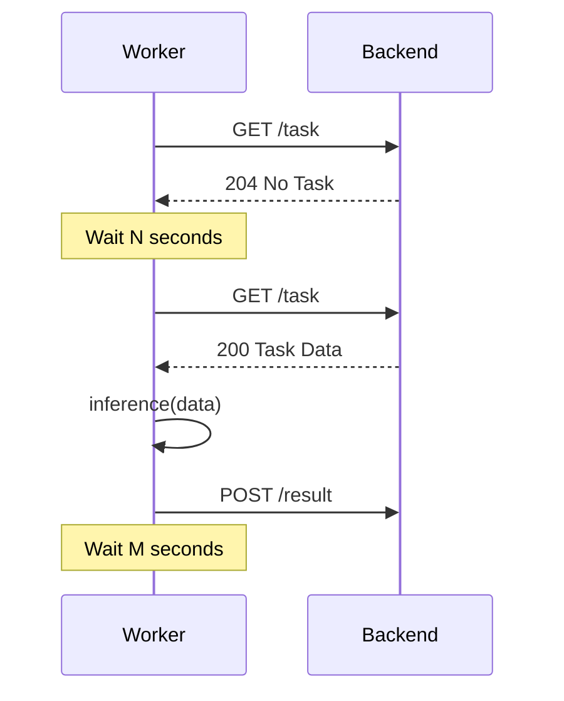

# Server for workers

Библиотека с сервером для воркеров, с помощью которых осуществляется связь с бэкендом, для того, чтобы брать задачи.

## Установка

Библиотека может быть установлена двумя способами.

### Установка напрямую из Git-репозитория

```bash
pip install git+https://gitlab.k8s.genai.int/gen-ai/fusion_team/backend/worker-server
```

### Установка из внутреннего PyPI (Nexus)

Внутренний PyPI‑репозиторий доступен только из внутренней сети (через VPN).

Пример установки пакета из Nexus:

```bash
pip install --index-url https://nexus.genai.int/repository/pypi/ worker-server
```

Либо можно задать переменную окружения `PIP_INDEX_URL` (например, в CI или локально перед установкой):

```bash
export PIP_INDEX_URL="https://nexus.genai.int/repository/pypi/"
pip install worker-server
```

## Информация о пакете

Исходный код лежит в `src/worker_server`.

Каждый воркер взаимодействует с сервером по следующей схеме:

1) Воркер отправляет HTTP-запрос на бэкенд, опрашивая его на наличие заданий
2) Если заданий нет, то воркер ожидает `N` секунд, затем переходит к п. 1. Если задания есть, то воркер получает задание и переходит к его выполнению (п. 3)
3) Воркер выдает задание модели, вызывая метод **worker.inference(data: Dict)**
4) Воркер выполняет задание. Обычно это генерация/инференс какой-то модели
5) Воркер отправляет HTTP-запрос на бэкенд с результатами, полученными от модели
6) Воркер ожидает `M` секунд и переходит к п. 1



## Работа и использование сервера

Для работы сервера необходимо:

1. Создать класс воркера, реализующий протокол `WorkerProtocol` с методом `inference`
2. Создать YAML-конфигурацию сервера
3. Инициализировать сервер и запустить основной цикл

### Пример реализации воркера

```python
from worker_server import WorkerProtocol

class MyWorker(WorkerProtocol):
    def inference(self, data: dict) -> dict:
        """
        Метод обработки задачи воркером
        
        Args:
            data: Входные данные задачи
            
        Returns:
            dict: Результат выполнения задачи
        """
        # Ваша логика обработки
        result = {
            "request_id": data["request_id"],
            "status": "DONE",
            "data": {"result": "processed_data"}
        }
        return result
```

### Работа с файлами (поле `files`)

Сервер умеет автоматически загружать бинарные файлы (например, изображения) в файловое хранилище и подставлять в результат их идентификаторы. Для этого используется поле `files` в данных задачи и ответа.

#### Входящие файлы в задаче

Если бэкенд прикрепил к задаче файлы, то воркер получает их в виде base64-строк:

- при получении задачи `ABCServer` (см. `abs_server.py`) автоматически:
  - скачивает файлы по их ID с бэкенда,
  - конвертирует в base64-строки,
  - кладёт список строк в `task.data["files"]`.

То есть в методе `inference` вы видите:

- `data["files"]`: `List[str]`, каждая строка — содержимое файла в base64.

Если вам нужны байты, вы можете декодировать их самостоятельно:

```python
import base64

class MyWorker(WorkerProtocol):
    def inference(self, data: dict) -> dict:
        files_b64 = data.get("files") or []
        files_bytes = [base64.b64decode(f) for f in files_b64]
        # ваша логика обработки файлов
        ...
        return {"result": "ok"}
```

#### Файлы в результате инференса

Чтобы отправить файлы обратно на бэкенд, воркер должен вернуть поле `files` в результате `inference`. Сервер сам займётся загрузкой файлов и подменой содержимого на идентификаторы.

Поддерживаются **два формата** элементов списка `files`:

- `bytes` — «сырое» содержимое файла (рекомендуемый и самый простой вариант);
- `str` — base64-строка (старый формат, поддерживается для обратной совместимости).

Рекомендуемый способ — передавать **байты**:

```python
class ImageProcessingWorker(WorkerProtocol):
    def inference(self, data: dict) -> dict:
        # ваша логика генерации изображений
        image_bytes_1 = open("image1.png", "rb").read()
        image_bytes_2 = open("image2.png", "rb").read()

        return {
            "result": "done",
            # можно передавать список bytes — сервер сам всё загрузит
            "files": [image_bytes_1, image_bytes_2],
        }
```

Сервер (`FileHandler.upload_files_to_s3`) сделает следующее:

1. Примет список `files` (элементы типа `bytes` или `str`);
2. Для `bytes` — сразу отправит содержимое файла;
3. Для `str` — сначала выполнит `base64.b64decode`, затем отправит;
4. Получит от бэкенда ID каждого файла;
5. Заменит содержимое поля `files` в результате инференса на список строк-идентификаторов и отправит результат обратно на бэкенд.

Таким образом, воркеру не нужно заботиться ни о формате ID, ни о том, как именно загружать файлы — достаточно вернуть список байтов в поле `files`.

### Конфигурационный файл

Создайте файл конфигурации (например, `default.yaml`):

```yaml
base_domain: "https://backend.example.com"
model_id: "my_model_v1"
default_params:
  param1: "default_value"
  param2: 42
delay: 5
connection_error_delay: 10
max_http_retries: 3
log_level: "INFO"
mtls_enabled: false
mtls_cert_path: null
ssl_verify: true
```

### Основной скрипт запуска сервера

```python
import signal
import time
from worker_server import HTTPServer, BasicServerConfig, WorkerProtocol

class ImageProcessingWorker(WorkerProtocol):
    def inference(self, data: dict) -> dict:
        # Имитация обработки изображения
        time.sleep(2)  # Симуляция работы
        
        return {
            "processed_images": ["image1.jpg", "image2.jpg"],
            "processing_time": 2.0
        }
    
class GracefulKiller:
    kill_now = False
    
    def __init__(self, logger):
        signal.signal(signal.SIGINT, self.exit_gracefully)
        signal.signal(signal.SIGTERM, self.exit_gracefully)
        self.logger = logger

    def exit_gracefully(self, signum, frame):
        self.logger.info("Exiting gracefully after this iteration")
        self.kill_now = True

if __name__ == "__main__":
    # Создаем воркера
    worker = ImageProcessingWorker()
    
    # Создаем сервер
    server = HTTPServer(
        worker=worker, 
        config_path="default.yaml"  # путь к файлу конфигурации
    )
    
    # Создаем обработчик graceful shutdown
    killer = GracefulKiller(server.logger)
    
    # Запускаем основной цикл
    server.run_loop(killer=killer)
```

## Конфигурационные параметры

### Параметры конфигурационного файла

- `base_domain`: Домен сервера для работы
- `model_id`: Идентификатор модели
- `default_params`: Параметры по умолчанию для задач
- `delay`: Задержка между опросами задач (в секундах)
- `connection_error_delay`: Задержка при ошибках соединения (в секундах)
- `max_http_retries`: Максимальное количество попыток HTTP-запросов
- `log_level`: Уровень логирования (строка: `"DEBUG"`, `"INFO"`, `"WARNING"`, `"ERROR"`, `"CRITICAL"`, по умолчанию: `"INFO"`)
- `mtls_enabled`: Включение/выключение mutual TLS (mTLS) для всех HTTP-запросов (булево значение, по умолчанию: `false`)
- `mtls_cert_path`: Путь к файлу клиентского сертификата для mTLS (строка или `null`, по умолчанию: `null`). Обязателен, если `mtls_enabled: true`
- `ssl_verify`: Настройка проверки SSL-сертификата сервера. Может быть:
  - `true` (по умолчанию) - использовать системные CA сертификаты для проверки
  - `false` - отключить проверку SSL-сертификата (не рекомендуется для production)
  - Путь к файлу CA bundle (строка) - использовать указанный файл с CA сертификатами для проверки. Полезно при использовании самоподписанных сертификатов или внутренних CA

#### Настройка mTLS

Для использования mutual TLS (mTLS) в запросах к бэкенду необходимо:

1. Установить `mtls_enabled: true` в конфигурационном файле
2. Указать путь к клиентскому сертификату в `mtls_cert_path`

Пример конфигурации с включенным mTLS:

```yaml
base_domain: "https://backend.example.com"
model_id: "my_model_v1"
default_params:
  param1: "default_value"
  param2: 42
delay: 5
connection_error_delay: 10
max_http_retries: 3
log_level: "INFO"
mtls_enabled: true
mtls_cert_path: "/path/to/client/certificate.pem"
ssl_verify: true
```

**Важно:** При включенном mTLS (`mtls_enabled: true`) необходимо указать корректный путь к файлу сертификата. Если файл не найден, сервер выдаст ошибку при инициализации. Все HTTP-запросы (получение задач, отправка результатов, загрузка/выгрузка файлов) будут использовать mTLS автоматически.

#### Настройка SSL верификации

Параметр `ssl_verify` позволяет настроить проверку SSL-сертификата сервера:

- **Использование системных CA сертификатов** (по умолчанию):
```yaml
ssl_verify: true
```

- **Отключение проверки SSL** (не рекомендуется для production):
```yaml
ssl_verify: false
```

- **Использование кастомного CA bundle** (для самоподписанных сертификатов или внутренних CA):
```yaml
ssl_verify: "/path/to/ca.pem"
```

Пример конфигурации с кастомным CA bundle и mTLS:

```yaml
base_domain: "https://backend.example.com:8443"
model_id: "my_model_v1"
default_params:
  param1: "default_value"
  param2: 42
delay: 5
connection_error_delay: 10
max_http_retries: 3
log_level: "INFO"
mtls_enabled: true
mtls_cert_path: "/path/to/client/certificate.pem"
ssl_verify: "/path/to/ca.pem"
```

**Примечание:** Если указан путь к CA bundle файлу, но файл не найден, сервер выдаст ошибку при инициализации.

### Параметры инициализации сервера

- `config_path`: Путь к файлу конфигурации (по умолчанию: `"default.yaml"`)

## Release & Publishing

- **Подготовка релиза**
  - Обновите версию пакета в секции `[project]` файла `pyproject.toml` (поле `version`) до нужного значения формата `X.Y.Z` (например, `1.2.3`).
  - Закоммитьте изменения и запушьте их в ветку `main`.

- **Создание тега версии**
  - Создайте git‑тег с той же версией, что и в `pyproject.toml`:
    ```bash
    git tag X.Y.Z
    git push origin X.Y.Z
    ```

- **Переменные окружения для публикации**
  - В настройках GitLab CI/CD проекта задайте следующие переменные:
    - `PYPI_INDEX_URL` — URL прокси PyPI в Nexus (read-only репозиторий, из которого будут скачиваться все зависимости и инструменты через uv/pip).
    - `NEXUS_PYPI_URL` — URL вашего приватного Nexus PyPI (например, `https://nexus.example.com/repository/pypi-internal/`).
    - `NEXUS_PYPI_USERNAME` — имя пользователя для доступа к репозиторию PyPI в Nexus.
    - `NEXUS_PYPI_PASSWORD` — пароль/токен для пользователя Nexus.

- **Работа GitLab CI**
  - При пуше любого коммита или тега:
    - Job `test` использует образ `ghcr.io/astral-sh/uv:python3.11`, устанавливает зависимости и пакет через `uv` из прокси PyPI (`PYPI_INDEX_URL`) и запускает `pytest` (при наличии тестов).
    - Job `build_package` с помощью `uv` устанавливает `build` из прокси PyPI и собирает артефакты пакета в директорию `dist/` через `python -m build`.
  - При пуше тега формата `X.Y.Z` (например, `1.2.3`):
    - Job `publish_to_nexus` устанавливает `twine` через `uv` из прокси PyPI и использует артефакты из `dist/`, публикуя их в ваш Nexus PyPI с помощью `twine` и переменных `NEXUS_PYPI_URL`, `NEXUS_PYPI_USERNAME`, `NEXUS_PYPI_PASSWORD`.
